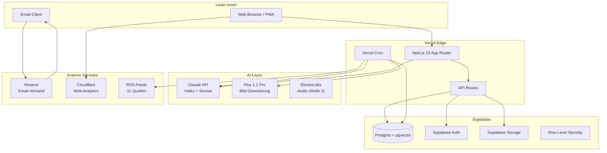
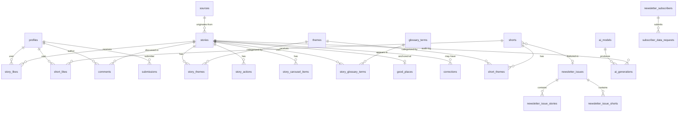
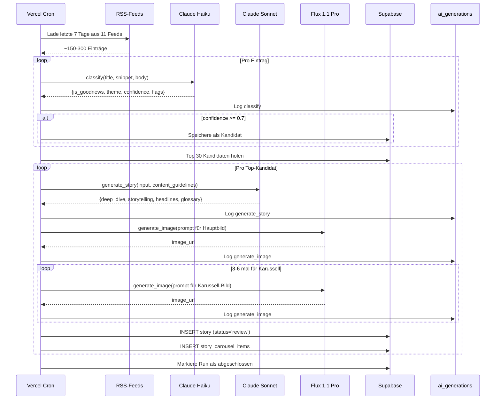
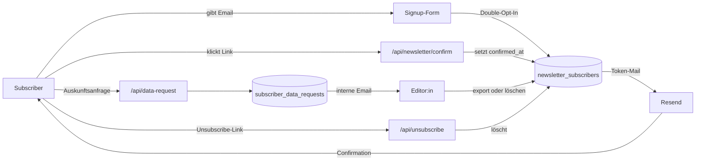

# Read Consciously — Architektur

> **Version 1.0** · Mai 2026 · Living Document
> Diese Datei ist die technische Bibel. Sie beschreibt das gesamte System: Datenmodell, AI-Pipeline, Auth, Frontend, Skalierung, Compliance. Sie ist gleichzeitig Onboarding-Dokument für neue Entwickler:innen und Kontext für Claude Code / Codex CLI.

---

## Inhalt

1. [System-Überblick](#system-überblick)
2. [Tech-Stack im Detail](#tech-stack-im-detail)
3. [Datenmodell](#datenmodell)
4. [AI-Pipeline](#ai-pipeline)
5. [Auth & RLS](#auth--rls)
6. [Frontend-Architektur](#frontend-architektur)
7. [API-Routen](#api-routen)
8. [Storage-Strategie](#storage-strategie)
9. [Caching & Performance](#caching--performance)
10. [DSGVO-Architektur](#dsgvo-architektur)
11. [EU AI Act-Compliance-Architektur](#eu-ai-act-compliance-architektur)
12. [Internationalisierung (i18n)](#internationalisierung-i18n)
13. [Testing-Strategie](#testing-strategie)
14. [Monitoring & Observability](#monitoring--observability)
15. [Deployment & CI/CD](#deployment--cicd)
16. [Skalierung](#skalierung)
17. [Backup & Recovery](#backup--recovery)
18. [Security](#security)
19. [Externe Abhängigkeiten](#externe-abhängigkeiten)

---

## System-Überblick

### High-Level-Diagramm



### Architektur-Prinzipien

1. **Server-First** — Wo möglich, läuft Logik server-seitig (Next.js Server Components, API Routes). Client-Bundles bleiben klein.
2. **Edge-Optimiert** — Statische Inhalte werden via Vercel Edge ausgeliefert. Dynamic Inhalte mit ISR (Incremental Static Regeneration).
3. **Supabase als Single Source of Truth** — Alle Daten in einer Postgres-DB. Keine Mikro-Services in Phase 1.
4. **AI als Pipeline, nicht als Realtime** — AI-Generierung läuft asynchron via Cron, nicht synchron pro Request. Spart Kosten und Latenz.
5. **Privacy by Design** — Datensparsamkeit, anonyme Likes, keine Drittanbieter-Tracker.
6. **Compliance by Architecture** — DSGVO und EU AI Act sind in das Datenmodell eingebaut, nicht nachträglich aufgesetzt.

---

## Tech-Stack im Detail

| Layer | Technologie | Version | Begründung |
|---|---|---|---|
| **Runtime** | Node.js | 20+ | Für Next.js 15 erforderlich |
| **Framework** | Next.js | 15 (App Router) | Industrie-Standard, hervorragende AI-Tool-Unterstützung |
| **Sprache** | TypeScript | 5.6+ | Strict Mode, vollständige Typisierung |
| **Styling** | Tailwind CSS | 4.0 | Utility-First, mit Theme-Variablen für Brand-Colors |
| **UI-Komponenten** | shadcn/ui | latest | Copy-Paste-Komponenten, voll anpassbar |
| **Icons** | Lucide React | latest | konsistente, schlanke Icon-Bibliothek |
| **i18n** | next-intl | 3.x | offizielle Empfehlung für Next.js |
| **Database** | Supabase Postgres | 15 | mit pgvector-Extension |
| **Auth** | Supabase Auth | latest | Magic Link Login (passwordless) |
| **Storage** | Supabase Storage | latest | für AI-generierte Bilder, Audio (Welle 2) |
| **AI-Pipeline (Text)** | Anthropic Claude | Haiku 4.5 + Sonnet 4.6 | siehe [AI-Pipeline](#ai-pipeline) |
| **AI-Pipeline (Bild)** | Black Forest Labs Flux | 1.1 Pro | beste Open-Source-Bildqualität, klare Lizenz |
| **AI-Pipeline (Audio)** | ElevenLabs | Multilingual v2 | ab Welle 2 |
| **Email-Templates** | react-email | latest | Komponenten als Code |
| **Email-Versand** | Resend | latest | Free Tier ausreichend für MVP |
| **Form-Validierung** | Zod | latest | TypeScript-First-Schema-Validierung |
| **Hosting** | Vercel | Hobby/Pro | beste Next.js-Integration |
| **Analytics** | Cloudflare Web Analytics | — | datenschutzfreundlich, ohne Cookies |
| **Domain & DNS** | Cloudflare | — | DNS + Proxy + Analytics in einem |
| **Monitoring** | Vercel Logs + Supabase Logs | — | nativ integriert |
| **Tests** | Vitest + Playwright | latest | Unit/Integration + E2E |
| **CI/CD** | GitHub Actions + Vercel | — | automatischer Deploy on Push |

---

## Datenmodell

### Übersicht aller Tabellen



### Schema-Datei-Layout

Migrations liegen in `supabase/migrations/`:

```
supabase/migrations/
├── 0001_extensions_and_enums.sql        # vector, pgcrypto, alle Enums
├── 0002_auth_and_profiles.sql           # auth.users-Trigger + profiles
├── 0003_themes_and_glossary.sql         # 8 Themen, Glossar
├── 0004_good_places.sql                 # Gute-Orte-Lookup
├── 0005_sources_and_ai_models.sql       # RSS-Quellen + AI-Modelle
├── 0006_stories_and_carousel.sql        # Stories mit Two-Track-Feldern
├── 0007_shorts.sql                      # Positive Shorts
├── 0008_likes_and_comments.sql          # Likes (auth + anonymous), Comments
├── 0009_newsletter.sql                  # Subscribers, Issues, Mappings
├── 0010_submissions.sql                 # Story-Einreichungen (Welle 3)
├── 0011_compliance.sql                  # AI-Generations-Audit, DSGVO-Anfragen, Korrekturen
├── 0012_rls_policies.sql                # Row Level Security
├── 0013_functions_and_triggers.sql      # Like-Counts, search_stories(), etc.
└── 0014_seed_data.sql                   # Themes, Beispiel-Sources, Test-Stories
```

### Enums

```sql
CREATE TYPE content_region AS ENUM ('local', 'national', 'international');
CREATE TYPE content_status AS ENUM ('draft', 'review', 'published', 'archived');

CREATE TYPE image_attribution AS ENUM ('human', 'ai_generated');

CREATE TYPE action_type AS ENUM (
  'read_more', 'donate', 'join', 'visit', 'sign', 'volunteer', 'other'
);

CREATE TYPE submission_status AS ENUM ('new', 'reviewing', 'accepted', 'rejected');

CREATE TYPE short_platform AS ENUM ('tiktok', 'instagram', 'youtube', 'other');

CREATE TYPE moderation_status AS ENUM ('pending', 'approved', 'rejected', 'flagged');

CREATE TYPE ai_generation_type AS ENUM (
  'classify', 'generate_story', 'generate_image', 'translate', 'audio_synthesis', 'other'
);

CREATE TYPE ai_output_type AS ENUM (
  'story', 'image', 'audio', 'video', 'translation', 'classification'
);

CREATE TYPE entity_type AS ENUM ('story', 'short');

CREATE TYPE comment_target AS ENUM ('story', 'short');

CREATE TYPE data_request_type AS ENUM ('access', 'deletion', 'export', 'objection');

CREATE TYPE source_rating AS ENUM ('A', 'B', 'C', 'D');
```

### Kerntabellen — Definitionen

#### `profiles` — Erweitert auth.users

```sql
CREATE TABLE profiles (
  id UUID PRIMARY KEY REFERENCES auth.users(id) ON DELETE CASCADE,
  display_name TEXT,
  preferred_locale TEXT NOT NULL DEFAULT 'de',
  preferred_track TEXT NOT NULL DEFAULT 'storytelling', -- 'deep_dive' | 'storytelling'
  subscribed_themes TEXT[] DEFAULT '{}',
  created_at TIMESTAMPTZ NOT NULL DEFAULT now(),
  updated_at TIMESTAMPTZ NOT NULL DEFAULT now()
);

-- Auto-erstellt bei Signup
CREATE OR REPLACE FUNCTION handle_new_user()
RETURNS TRIGGER AS $$
BEGIN
  INSERT INTO profiles (id) VALUES (NEW.id);
  RETURN NEW;
END;
$$ LANGUAGE plpgsql SECURITY DEFINER;

CREATE TRIGGER on_auth_user_created
  AFTER INSERT ON auth.users
  FOR EACH ROW EXECUTE FUNCTION handle_new_user();
```

#### `themes` — 8 fixe Dimensionen

```sql
CREATE TABLE themes (
  id TEXT PRIMARY KEY,                 -- z.B. 'economy', 'climate'
  name_de TEXT NOT NULL,
  name_en TEXT NOT NULL,
  description_de TEXT NOT NULL,
  description_en TEXT NOT NULL,
  color_hex TEXT NOT NULL,
  display_order INT NOT NULL,
  created_at TIMESTAMPTZ NOT NULL DEFAULT now()
);

-- Seed
INSERT INTO themes (id, name_de, name_en, description_de, description_en, color_hex, display_order) VALUES
  ('economy', 'Wirtschaft, die heilt', 'Economy that heals', '...', '...', '#2C4A3E', 1),
  ('climate', 'Klima & Regeneration', 'Climate & Regeneration', '...', '...', '#3D8B7A', 2),
  ('community', 'Nachbarschaft & Gemeinde', 'Community & Place', '...', '...', '#E8843C', 3),
  ('consciousness', 'Bewusstseinswandel', 'Consciousness', '...', '...', '#8B6FB1', 4),
  ('democracy', 'Demokratie & Beteiligung', 'Democracy & Participation', '...', '...', '#C04B4B', 5),
  ('culture', 'Kultur & Beziehungen', 'Culture & Relationships', '...', '...', '#D4A547', 6),
  ('mental_health', 'Mental Health & Resilienz', 'Mental Health & Resilience', '...', '...', '#5B8FAB', 7),
  ('innovation', 'Innovation mit Sinn', 'Innovation with Purpose', '...', '...', '#6B7BAB', 8);
```

#### `glossary_terms` — Konsistente Erklärungshilfen

```sql
CREATE TABLE glossary_terms (
  id UUID PRIMARY KEY DEFAULT gen_random_uuid(),
  term TEXT UNIQUE NOT NULL,            -- z.B. 'Doughnut-Ökonomie'
  definition_de TEXT NOT NULL,          -- 1–2 Sätze, max 300 Zeichen
  definition_en TEXT NOT NULL,
  canonical_url TEXT,                   -- vertrauenswürdige Quelle
  related_terms TEXT[] DEFAULT '{}',
  usage_count INT NOT NULL DEFAULT 0,   -- denormalisiert
  created_at TIMESTAMPTZ NOT NULL DEFAULT now(),
  updated_at TIMESTAMPTZ NOT NULL DEFAULT now()
);

CREATE INDEX idx_glossary_term_lower ON glossary_terms (LOWER(term));
```

#### `good_places` — „Gute Orte"-Lookup

```sql
CREATE TABLE good_places (
  id UUID PRIMARY KEY DEFAULT gen_random_uuid(),
  name TEXT NOT NULL,                   -- z.B. 'Schönau im Schwarzwald'
  region TEXT,                          -- z.B. 'Baden-Württemberg'
  country TEXT NOT NULL,                -- 'DE' | 'AT' | 'CH'
  latitude NUMERIC(9,6),
  longitude NUMERIC(9,6),
  description_de TEXT,
  description_en TEXT,
  website TEXT,
  contact_email TEXT,
  visit_info TEXT,                      -- "Anreise mit Bahn, Führungen Sa 14:00"
  last_featured_at TIMESTAMPTZ,
  created_at TIMESTAMPTZ NOT NULL DEFAULT now(),
  updated_at TIMESTAMPTZ NOT NULL DEFAULT now()
);

CREATE INDEX idx_good_places_country ON good_places (country);
```

#### `sources` — RSS-Feed-Datenbank mit Bewertungen

```sql
CREATE TABLE sources (
  id UUID PRIMARY KEY DEFAULT gen_random_uuid(),
  name TEXT NOT NULL,                   -- z.B. 'Perspective Daily'
  url TEXT NOT NULL,
  rss_url TEXT NOT NULL UNIQUE,
  locale TEXT NOT NULL,                 -- 'de' | 'en'
  rating source_rating NOT NULL,        -- A | B | C | D
  primary_themes TEXT[] DEFAULT '{}',   -- z.B. ARRAY['economy', 'climate']
  active BOOLEAN NOT NULL DEFAULT true,
  last_fetched_at TIMESTAMPTZ,
  notes TEXT,
  created_at TIMESTAMPTZ NOT NULL DEFAULT now(),
  updated_at TIMESTAMPTZ NOT NULL DEFAULT now()
);
```

#### `stories` — Hauptobjekt mit Two-Track-Feldern

```sql
CREATE TABLE stories (
  id UUID PRIMARY KEY DEFAULT gen_random_uuid(),
  slug TEXT UNIQUE NOT NULL,
  status content_status NOT NULL DEFAULT 'draft',
  region content_region NOT NULL,

  -- „Gute Orte"-Verankerung
  is_local_anchor BOOLEAN NOT NULL DEFAULT false,
  good_place_id UUID REFERENCES good_places(id) ON DELETE SET NULL,

  -- Geteilte Felder
  title_de TEXT NOT NULL,
  title_en TEXT,
  subtitle_de TEXT,
  subtitle_en TEXT,
  source_urls TEXT[] DEFAULT '{}',

  -- Deep Dive Track
  deep_dive_body_de TEXT,               -- Markdown
  deep_dive_body_en TEXT,
  deep_dive_image_url TEXT,
  deep_dive_image_caption_de TEXT,
  deep_dive_image_caption_en TEXT,
  deep_dive_image_attribution image_attribution NOT NULL DEFAULT 'ai_generated',
  deep_dive_image_model TEXT,            -- z.B. 'flux-1.1-pro'
  deep_dive_image_prompt TEXT,           -- für AI Registry / Audit

  -- Storytelling Track
  storytelling_body_de TEXT,
  storytelling_body_en TEXT,
  storytelling_audio_url_de TEXT,
  storytelling_audio_url_en TEXT,
  storytelling_video_url_de TEXT,
  storytelling_video_url_en TEXT,
  storytelling_avatar_url TEXT,

  -- AI-Audit
  generated_by_model TEXT,              -- 'claude-sonnet-4-6'
  generated_at TIMESTAMPTZ,
  edited_by UUID REFERENCES auth.users(id),
  edited_at TIMESTAMPTZ,

  -- Counts (denormalisiert via Trigger)
  like_count INT NOT NULL DEFAULT 0,
  view_count INT NOT NULL DEFAULT 0,

  -- Vector Search
  embedding vector(1024),

  -- Newsletter
  newsletter_issue_id UUID,             -- nicht FK wegen Reihenfolge

  -- Metadaten
  published_at TIMESTAMPTZ,
  created_at TIMESTAMPTZ NOT NULL DEFAULT now(),
  updated_at TIMESTAMPTZ NOT NULL DEFAULT now()
);

CREATE INDEX idx_stories_status_published ON stories (status, published_at DESC);
CREATE INDEX idx_stories_slug ON stories (slug);
CREATE INDEX idx_stories_local_anchor ON stories (is_local_anchor) WHERE is_local_anchor = true;
CREATE INDEX idx_stories_embedding ON stories USING ivfflat (embedding vector_cosine_ops);
```

#### `story_carousel_items` — Storytelling-Karussell

```sql
CREATE TABLE story_carousel_items (
  id UUID PRIMARY KEY DEFAULT gen_random_uuid(),
  story_id UUID NOT NULL REFERENCES stories(id) ON DELETE CASCADE,
  display_order INT NOT NULL,            -- 1 bis 6
  image_url TEXT NOT NULL,
  image_attribution image_attribution NOT NULL DEFAULT 'ai_generated',
  image_model TEXT,
  image_prompt TEXT,
  caption_de TEXT NOT NULL,
  caption_en TEXT,
  created_at TIMESTAMPTZ NOT NULL DEFAULT now(),

  UNIQUE (story_id, display_order)
);
```

#### `ai_generations` — EU AI Act Audit Log

```sql
CREATE TABLE ai_generations (
  id UUID PRIMARY KEY DEFAULT gen_random_uuid(),
  generation_type ai_generation_type NOT NULL,
  output_type ai_output_type NOT NULL,
  model_name TEXT NOT NULL,
  model_version TEXT,
  output_id TEXT,                       -- Story-ID, Image-Path, etc.
  prompt TEXT,                          -- der vollständige Prompt
  prompt_hash TEXT NOT NULL,            -- SHA256 für schnelle Suche
  input_summary TEXT,                   -- Hash der Eingabe + Brief
  token_count_input INT,
  token_count_output INT,
  cost_usd NUMERIC(10,6),
  metadata JSONB DEFAULT '{}',
  created_at TIMESTAMPTZ NOT NULL DEFAULT now()
);

CREATE INDEX idx_ai_generations_type ON ai_generations (generation_type, created_at DESC);
CREATE INDEX idx_ai_generations_output ON ai_generations (output_id);
CREATE INDEX idx_ai_generations_model ON ai_generations (model_name);
```

#### `ai_models` — Registry

```sql
CREATE TABLE ai_models (
  id UUID PRIMARY KEY DEFAULT gen_random_uuid(),
  name TEXT NOT NULL UNIQUE,            -- z.B. 'claude-sonnet-4-6'
  display_name TEXT NOT NULL,           -- 'Claude Sonnet 4.6'
  provider TEXT NOT NULL,               -- 'Anthropic'
  version TEXT,
  usage_purpose TEXT NOT NULL,          -- 'Story-Generierung'
  license_type TEXT NOT NULL,           -- 'Commercial API'
  avv_signed_at TIMESTAMPTZ,            -- Auftragsverarbeitung
  last_audited_at TIMESTAMPTZ,
  active BOOLEAN NOT NULL DEFAULT true,
  notes TEXT,
  created_at TIMESTAMPTZ NOT NULL DEFAULT now()
);
```

#### `corrections` — Öffentliche Korrekturen-Liste

```sql
CREATE TABLE corrections (
  id UUID PRIMARY KEY DEFAULT gen_random_uuid(),
  story_id UUID REFERENCES stories(id) ON DELETE SET NULL,
  description_de TEXT NOT NULL,
  description_en TEXT,
  original_text TEXT,
  corrected_text TEXT,
  severity TEXT NOT NULL DEFAULT 'minor', -- 'minor' | 'major' (mit Email)
  corrected_at TIMESTAMPTZ NOT NULL DEFAULT now()
);
```

#### `subscriber_data_requests` — DSGVO-Anfragen

```sql
CREATE TABLE subscriber_data_requests (
  id UUID PRIMARY KEY DEFAULT gen_random_uuid(),
  email TEXT NOT NULL,
  request_type data_request_type NOT NULL,
  status TEXT NOT NULL DEFAULT 'new',   -- 'new' | 'processing' | 'completed'
  received_at TIMESTAMPTZ NOT NULL DEFAULT now(),
  completed_at TIMESTAMPTZ,
  notes TEXT
);

CREATE INDEX idx_data_requests_status ON subscriber_data_requests (status, received_at);
```

#### `newsletter_subscribers`

```sql
CREATE TABLE newsletter_subscribers (
  id UUID PRIMARY KEY DEFAULT gen_random_uuid(),
  email TEXT UNIQUE NOT NULL,
  locale TEXT NOT NULL DEFAULT 'de',
  preferred_track TEXT NOT NULL DEFAULT 'storytelling',
  confirmation_token TEXT UNIQUE,        -- gehasht
  confirmed_at TIMESTAMPTZ,              -- NULL bis Double-Opt-In
  unsubscribed_at TIMESTAMPTZ,
  unsubscribe_token TEXT UNIQUE NOT NULL DEFAULT encode(gen_random_bytes(32), 'hex'),
  created_at TIMESTAMPTZ NOT NULL DEFAULT now()
);

CREATE INDEX idx_subscribers_confirmed ON newsletter_subscribers (confirmed_at)
  WHERE unsubscribed_at IS NULL;
```

#### `anonymous_likes` — DSGVO-konform

```sql
CREATE TABLE anonymous_likes (
  id UUID PRIMARY KEY DEFAULT gen_random_uuid(),
  entity_type entity_type NOT NULL,
  entity_id UUID NOT NULL,
  fingerprint_hash TEXT NOT NULL,        -- SHA256 aus IP+UA, anonymisiert
  created_at TIMESTAMPTZ NOT NULL DEFAULT now(),

  UNIQUE (entity_type, entity_id, fingerprint_hash)
);

CREATE INDEX idx_anon_likes_entity ON anonymous_likes (entity_type, entity_id);
```

> **Hinweis zu `fingerprint_hash`:** Der Fingerprint ist eine SHA256-Summe aus User-Agent + IP-Subnet (nicht volle IP) + Salt. Salt wird täglich rotiert. Damit ist der Hash nicht zurückführbar auf eine Person, erlaubt aber trotzdem Like-Deduplizierung pro Tag.

### Triggers für Counts

```sql
CREATE OR REPLACE FUNCTION update_story_like_count()
RETURNS TRIGGER AS $$
BEGIN
  IF TG_OP = 'INSERT' THEN
    UPDATE stories SET like_count = like_count + 1 WHERE id = NEW.story_id;
  ELSIF TG_OP = 'DELETE' THEN
    UPDATE stories SET like_count = like_count - 1 WHERE id = OLD.story_id;
  END IF;
  RETURN NULL;
END;
$$ LANGUAGE plpgsql;

CREATE TRIGGER trg_story_like_count
  AFTER INSERT OR DELETE ON story_likes
  FOR EACH ROW EXECUTE FUNCTION update_story_like_count();

-- Analog für anonymous_likes mit entity_type='story'
```

### Pre-Compose-Validierung — „Gute Orte" Pflicht

```sql
-- Funktion, die prüft, ob ein Newsletter Issue mind. eine Local-Anchor-Story enthält
CREATE OR REPLACE FUNCTION validate_newsletter_has_local_anchor(issue_id UUID)
RETURNS BOOLEAN AS $$
DECLARE
  has_local_anchor BOOLEAN;
BEGIN
  SELECT EXISTS (
    SELECT 1 FROM newsletter_issue_stories nis
    JOIN stories s ON s.id = nis.story_id
    WHERE nis.newsletter_issue_id = issue_id
      AND s.is_local_anchor = true
  ) INTO has_local_anchor;

  RETURN has_local_anchor;
END;
$$ LANGUAGE plpgsql;

-- Constraint: Status kann nur auf 'scheduled' wechseln, wenn Validierung erfüllt
CREATE OR REPLACE FUNCTION enforce_local_anchor_constraint()
RETURNS TRIGGER AS $$
BEGIN
  IF NEW.status = 'scheduled' AND OLD.status != 'scheduled' THEN
    IF NOT validate_newsletter_has_local_anchor(NEW.id) THEN
      RAISE EXCEPTION 'Newsletter Issue % has no local-anchor story. Pflicht „Gute Orte" verletzt.', NEW.id;
    END IF;
  END IF;
  RETURN NEW;
END;
$$ LANGUAGE plpgsql;

CREATE TRIGGER trg_local_anchor_constraint
  BEFORE UPDATE ON newsletter_issues
  FOR EACH ROW EXECUTE FUNCTION enforce_local_anchor_constraint();
```

> **Wirkung:** Das System verhindert auf Datenbank-Ebene, dass ein Newsletter ohne „Gute Orte"-Story versendet wird. Selbst wenn die Redaktion es übersieht, bekommt sie einen Fehler beim Scheduling.

---

## AI-Pipeline

### Sequenzdiagramm — Wöchentlicher Lauf (Sonntag 06:00)



### Stufe 1 — Klassifikation (Claude Haiku 4.5)

**System-Prompt-Skelett** (`scripts/ai-pipeline/prompts/classify.ts`):

```typescript
export const CLASSIFY_SYSTEM_PROMPT = `
Du bist Klassifikator:in bei Read Consciously, einem deutschsprachigen
Newsletter für Solutions Journalism mit Fokus auf Bewusstseinswandel.

Bewerte den folgenden RSS-Eintrag nach diesen Kriterien:

1. is_goodnews (boolean) — passt der Eintrag zu Read Consciously?
   - Solutions Journalism: zeigt eine Lösung mit nachweisbarer Wirkung
   - Bewusstseinswandel-Themen: integral, achtsam, transformativ
   - KEINE: Tagespolitik, Promi-Klatsch, Sport, Skandale, Greenwashing-PR

2. theme (enum) — Hauptdimension:
   - economy, climate, community, consciousness,
   - democracy, culture, mental_health, innovation

3. subdimensions (array) — bis zu 2 Nebendimensionen

4. region (enum) — local | national | international

5. is_local_anchor_candidate (boolean) — passt das zu Welzers
   "Gute Orte"-Konzept (lokal verankert, konkret, reproduzierbar)?

6. confidence (float 0–1) — wie sicher bist du?

7. flags (array) — Warn-Flags:
   - 'greenwashing_verdacht' — könnte PR sein
   - 'tox_positivity' — zu schöngefärbt
   - 'esoterik_wash' — Esoterik ohne Substanz
   - 'fact_check_needed' — Zahlen müssen verifiziert werden

Threshold für Aufnahme: confidence >= 0.7

Antworte ausschließlich als JSON-Objekt.
`;
```

**Modell-Konfiguration:**
- Model: `claude-haiku-4-5-20251001`
- max_tokens: 500
- temperature: 0.2 (konsistent klassifizieren)

### Stufe 2 — Story-Generierung (Claude Sonnet 4.6)

**System-Prompt-Skelett** (`scripts/ai-pipeline/prompts/generate-story.ts`):

```typescript
export const GENERATE_STORY_SYSTEM_PROMPT = `
Du bist Redakteur:in bei Read Consciously. Erstelle aus den
folgenden Quellen eine Story nach unseren Standards.

UNSERE STANDARDS (verkürzt):
- Vier Säulen: Problem (15%), Lösung (45%), Wirkung (25%), Limitationen (15%)
- Tonalität: editorial, nicht kitschig, nicht Boulevard
- KEINE Affektworte: 'magisch', 'wundervoll', 'unglaublich', 'revolutionär'
- KEINE Toxic Positivity
- Fachbegriffe: bei Erstnennung inline erklären oder verlinken
- Quellen: mindestens 3, mit Datum
- Mindestens eine zitierte Person

GENERIERE ZWEI VARIANTEN:

1. DEEP DIVE (400–800 Wörter):
   - Strukturiert nach den vier Säulen
   - Distanziert-redaktionelle Tonalität
   - Komplette Quellenliste am Ende
   - Glossar-Vorschläge für Fachbegriffe

2. STORYTELLING (150–300 Wörter):
   - Narrative, bildhafte Sprache
   - Persönlich-einordnende Tonalität
   - 3–6 Karussell-Items mit jeweils 1–2 Sätzen + Bild-Prompt
   - Kompakte Darstellung der vier Säulen

ZUSÄTZLICH:
- 3 Headline-Varianten (direkt, bildhaft, paradox)
- 1 Subhead
- Vorgeschlagene Aktionen (Anschluss-Möglichkeiten)
- Bild-Prompt für Hauptbild im Stil "illustrativ, gedämpfte Farben,
  editorial, keine echten Personen"

Antworte als JSON-Objekt mit allen Feldern.
`;
```

**Modell-Konfiguration:**
- Model: `claude-sonnet-4-6`
- max_tokens: 4000
- temperature: 0.7 (kreativer)

### Stufe 3 — Bild-Generierung (Flux 1.1 Pro)

```typescript
// scripts/ai-pipeline/flux/generate.ts
import Replicate from "replicate";

const replicate = new Replicate({ auth: process.env.REPLICATE_API_TOKEN });

export async function generateImage(prompt: string, story_id: string) {
  const enhancedPrompt = `
    ${prompt},
    illustrative editorial style,
    muted color palette, no real persons,
    no text overlay, photographic-realistic disabled,
    16:9 aspect ratio
  `.trim();

  const output = await replicate.run(
    "black-forest-labs/flux-1.1-pro",
    {
      input: {
        prompt: enhancedPrompt,
        aspect_ratio: "16:9",
        output_format: "webp",
        output_quality: 85,
        safety_tolerance: 2,
      },
    },
  );

  // Audit log
  await logAIGeneration({
    type: 'generate_image',
    output_type: 'image',
    model_name: 'flux-1.1-pro',
    prompt: enhancedPrompt,
    output_id: story_id,
    cost_usd: 0.04, // Flux Pro pricing
  });

  return output;
}
```

**Sicherheits-Regeln im Prompt:**
- *„no real persons"* — keine fotorealistischen Menschen
- *„illustrative editorial style"* — Charakter klar erkennbar als Illustration
- *„no text overlay"* — keine Text-Halluzinationen

### Stufe 4 — Übersetzung (Claude Haiku 4.5)

```typescript
export const TRANSLATE_SYSTEM_PROMPT = `
Übersetze den folgenden deutschen Text ins Englische — für
internationale Leser:innen mit Affinität zu europäischen
Diskursen.

REGELN:
- Wir übertragen Bedeutung, nicht Worte
- Eigennamen bleiben (Schönau, EWS, Bürgerrat)
- Spezifische deutsche Begriffe bleiben deutsch + Erklärung in
  Klammern (z.B. "Bürgerrat (citizens' council)")
- Idiome werden ersetzt, nicht übersetzt
- Tonalität: editorial-magazine, nicht academic, nicht boulevard

Übersetze sowohl Deep-Dive- als auch Storytelling-Variante.
`;
```

### Pipeline-Audit-Logging

Jeder AI-Aufruf wird in `ai_generations` protokolliert:

```typescript
// lib/claude/audit.ts
export async function logAIGeneration(entry: AIGenerationEntry) {
  const supabase = createServiceClient();

  const promptHash = await sha256(entry.prompt);

  await supabase.from('ai_generations').insert({
    generation_type: entry.type,
    output_type: entry.output_type,
    model_name: entry.model_name,
    prompt: entry.prompt,
    prompt_hash: promptHash,
    output_id: entry.output_id,
    token_count_input: entry.token_count_input,
    token_count_output: entry.token_count_output,
    cost_usd: entry.cost_usd,
    metadata: entry.metadata || {},
  });
}
```

> **Wichtig für EU AI Act:** Diese Logs ermöglichen uns, auf Anfrage einer Behörde nachzuweisen, dass und wie ein bestimmter Inhalt KI-generiert wurde. Aufbewahrung: mindestens 6 Monate.

### Wöchentliche Pipeline-Kosten (geschätzt)

| Stufe | Aufrufe pro Woche | Kosten pro Aufruf | Wöchentlich | Monatlich |
|---|---|---|---|---|
| Klassifikation (Haiku) | ~250 | ~$0.0005 | $0.13 | $0.52 |
| Story-Generierung (Sonnet) | ~30 | ~$0.04 | $1.20 | $4.80 |
| Bild-Generierung (Flux) | ~210 | $0.04 | $8.40 | $33.60 |
| Übersetzung (Haiku) | ~30 (jeweils 2 Varianten) | ~$0.001 | $0.06 | $0.24 |
| **Gesamt** | | | **$9.79** | **~$39 (~ 36€)** |

> **Hinweis:** Die Bild-Generierung ist der teuerste Posten. Bei knappem Budget können wir auf 2 Bilder pro Story (1 Hauptbild + 3 Karussell-Items) reduzieren. Dann sind wir bei ~$15/Monat.

---

## Auth & RLS

### Auth-Strategie

- **Magic Link Login** *(passwordless)* via Supabase Auth — keine Passwörter, keine Komplexität
- **Optional Account** — Newsletter-Anmeldung erfordert keinen Account; Account ist nötig für Likes (auth), personalisierten Feed, Kommentare
- **Session-Verwaltung** via Supabase Cookies (httpOnly, sameSite=lax)
- **Newsletter-Anmeldung separat** — eigene Tabelle `newsletter_subscribers`, mit Double-Opt-In über Token

### Row Level Security (RLS) Policies

```sql
-- Stories: published Stories sind öffentlich lesbar
ALTER TABLE stories ENABLE ROW LEVEL SECURITY;

CREATE POLICY "Published stories are public" ON stories
  FOR SELECT USING (status = 'published');

CREATE POLICY "Editors can manage all stories" ON stories
  FOR ALL USING (
    EXISTS (
      SELECT 1 FROM auth.users
      WHERE auth.users.id = auth.uid()
      AND auth.users.raw_app_meta_data->>'role' = 'editor'
    )
  );

-- Story Likes: User kann eigene Likes verwalten
ALTER TABLE story_likes ENABLE ROW LEVEL SECURITY;

CREATE POLICY "Users can view their own likes" ON story_likes
  FOR SELECT USING (auth.uid() = user_id);

CREATE POLICY "Users can like stories" ON story_likes
  FOR INSERT WITH CHECK (auth.uid() = user_id);

CREATE POLICY "Users can unlike stories" ON story_likes
  FOR DELETE USING (auth.uid() = user_id);

-- Profiles: User kann eigenes Profil verwalten
ALTER TABLE profiles ENABLE ROW LEVEL SECURITY;

CREATE POLICY "Users can view their own profile" ON profiles
  FOR SELECT USING (auth.uid() = id);

CREATE POLICY "Users can update their own profile" ON profiles
  FOR UPDATE USING (auth.uid() = id);

-- AI Generations: nur Service-Role schreibt, niemand außer Editor liest
ALTER TABLE ai_generations ENABLE ROW LEVEL SECURITY;

CREATE POLICY "Editors can read AI generations" ON ai_generations
  FOR SELECT USING (
    EXISTS (
      SELECT 1 FROM auth.users
      WHERE auth.users.id = auth.uid()
      AND auth.users.raw_app_meta_data->>'role' = 'editor'
    )
  );

-- Newsletter Subscribers: niemand außer Service-Role
ALTER TABLE newsletter_subscribers ENABLE ROW LEVEL SECURITY;
-- Keine SELECT-Policy → nur Service-Role kann lesen

-- Anonymous Likes: niemand kann lesen, nur INSERT via API
ALTER TABLE anonymous_likes ENABLE ROW LEVEL SECURITY;
-- Keine SELECT-Policy
```

### Editor-Rolle

Editoren werden über `auth.users.raw_app_meta_data->>'role' = 'editor'` markiert. Die Markierung erfolgt manuell im Supabase-Dashboard.

```sql
-- Setze Editor-Rolle (im Supabase SQL Editor):
UPDATE auth.users
SET raw_app_meta_data = raw_app_meta_data || '{"role": "editor"}'::jsonb
WHERE email = 'editor@readconsciously.com';
```

---

## Frontend-Architektur

### Verzeichnis-Struktur

```
src/
├── app/
│   ├── [locale]/                        # Locale-Wrapper
│   │   ├── layout.tsx                   # NextIntlClientProvider
│   │   ├── page.tsx                     # Landing
│   │   ├── feed/page.tsx                # Story-Listing
│   │   ├── shorts/page.tsx              # Shorts-Grid
│   │   ├── search/page.tsx              # AI-Suche
│   │   ├── story/[slug]/page.tsx        # Story-Detail
│   │   ├── good-places/page.tsx         # „Gute Orte" Karte
│   │   ├── account/page.tsx             # Welle 2
│   │   ├── submit/page.tsx              # Welle 3
│   │   ├── corrections/page.tsx
│   │   ├── about/page.tsx
│   │   ├── privacy/page.tsx
│   │   ├── imprint/page.tsx
│   │   └── ai-registry/page.tsx
│   ├── api/
│   │   ├── newsletter/
│   │   │   ├── route.ts
│   │   │   └── confirm/route.ts
│   │   ├── like/route.ts
│   │   ├── search/route.ts
│   │   ├── submission/route.ts
│   │   ├── data-request/route.ts
│   │   ├── unsubscribe/route.ts
│   │   └── webhook/resend/route.ts
│   ├── globals.css
│   └── layout.tsx
├── components/
│   ├── layout/
│   │   ├── site-header.tsx
│   │   ├── site-footer.tsx
│   │   └── locale-switcher.tsx
│   ├── story/
│   │   ├── story-card.tsx
│   │   ├── story-detail.tsx
│   │   ├── story-toggle.tsx             # Deep Dive ↔ Storytelling
│   │   ├── deep-dive-view.tsx
│   │   ├── storytelling-view.tsx
│   │   ├── carousel.tsx
│   │   ├── good-place-badge.tsx
│   │   ├── ai-disclosure.tsx            # AI-Kennzeichnung
│   │   ├── glossary-box.tsx
│   │   └── like-button.tsx
│   ├── shorts/
│   │   ├── short-card.tsx
│   │   └── lichtblick-hero.tsx
│   ├── newsletter/
│   │   ├── signup-form.tsx
│   │   └── confirmation-success.tsx
│   ├── search/
│   │   └── search-interface.tsx
│   └── ui/                              # shadcn/ui base
├── lib/
│   ├── supabase/
│   │   ├── client.ts                    # Browser Client
│   │   ├── server.ts                    # Server Client
│   │   ├── service.ts                   # Service-Role
│   │   └── types.ts
│   ├── claude/
│   │   ├── client.ts
│   │   ├── prompts/
│   │   │   ├── classify.ts
│   │   │   ├── generate-story.ts
│   │   │   └── translate.ts
│   │   └── audit.ts
│   ├── flux/
│   │   ├── client.ts
│   │   └── generate.ts
│   ├── resend/
│   │   ├── client.ts
│   │   └── send.ts
│   ├── i18n/
│   │   ├── config.ts
│   │   ├── request.ts
│   │   └── routing.ts
│   ├── analytics/
│   │   └── cloudflare.ts
│   ├── fingerprint/
│   │   └── browser.ts                   # Anonymous Likes
│   ├── glossary/
│   │   └── lookup.ts
│   └── utils.ts
├── messages/
│   ├── de.json
│   └── en.json
├── emails/
│   ├── confirmation.tsx
│   ├── weekly-newsletter.tsx
│   ├── correction-notice.tsx
│   └── unsubscribe-confirmation.tsx
├── middleware.ts                        # i18n + Auth-Routing
└── types/
    └── database.ts                      # generiert von Supabase CLI
```

### Server vs. Client Components

**Server Components (Default):**
- Alle `page.tsx` Komponenten
- Datenfetching aus Supabase
- Markdown-Rendering
- Story-Listing

**Client Components (`"use client"`)** — nur wenn nötig:
- `like-button.tsx` (interaktiv)
- `story-toggle.tsx` (interaktiv)
- `signup-form.tsx` (Form-Handling)
- `search-interface.tsx` (interaktiv)
- `carousel.tsx` (Swiping)

### State Management

- **Server-State:** Direkt aus Supabase via Server Components
- **Client-State:** React `useState`, `useReducer` für lokale Komponenten
- **URL-State:** Suchparameter via `useSearchParams`
- **Persistent Preferences:** Cookies (Track-Präferenz, Locale) über Server Actions

---

## API-Routen

### Newsletter-Anmeldung (`POST /api/newsletter`)

```typescript
import { z } from "zod";
import { NextRequest, NextResponse } from "next/server";
import { createServiceClient } from "@/lib/supabase/service";
import { sendConfirmationEmail } from "@/lib/resend/send";
import crypto from "crypto";

const SignupSchema = z.object({
  email: z.string().email(),
  locale: z.enum(["de", "en"]),
  preferred_track: z.enum(["deep_dive", "storytelling"]).optional(),
});

export async function POST(request: NextRequest) {
  const body = await request.json();
  const result = SignupSchema.safeParse(body);

  if (!result.success) {
    return NextResponse.json({ error: "Invalid input" }, { status: 400 });
  }

  const { email, locale, preferred_track = "storytelling" } = result.data;
  const supabase = createServiceClient();

  // Confirmation Token
  const token = crypto.randomBytes(32).toString("hex");
  const tokenHash = crypto.createHash("sha256").update(token).digest("hex");

  const { error } = await supabase
    .from("newsletter_subscribers")
    .upsert({ email, locale, preferred_track, confirmation_token: tokenHash });

  if (error) {
    return NextResponse.json({ error: "DB error" }, { status: 500 });
  }

  await sendConfirmationEmail({ email, token, locale });

  return NextResponse.json({ ok: true });
}
```

### Like (`POST /api/like`)

```typescript
import { z } from "zod";
import { createClient } from "@/lib/supabase/server";
import { createServiceClient } from "@/lib/supabase/service";
import { hashFingerprint } from "@/lib/fingerprint/browser";

const LikeSchema = z.object({
  entity_type: z.enum(["story", "short"]),
  entity_id: z.string().uuid(),
});

export async function POST(request: NextRequest) {
  const result = LikeSchema.safeParse(await request.json());
  if (!result.success) return NextResponse.json({ error: "Invalid" }, { status: 400 });

  const { entity_type, entity_id } = result.data;
  const supabase = createClient();
  const { data: { user } } = await supabase.auth.getUser();

  if (user) {
    const table = entity_type === "story" ? "story_likes" : "short_likes";
    const fkColumn = entity_type === "story" ? "story_id" : "short_id";
    const { error } = await supabase.from(table).insert({
      [fkColumn]: entity_id, user_id: user.id,
    });
    if (error?.code === "23505") {
      // Bereits geliked → unliken
      await supabase.from(table).delete().match({ [fkColumn]: entity_id, user_id: user.id });
    }
  } else {
    // Anonymer Like
    const ip = request.headers.get("x-forwarded-for") || "unknown";
    const userAgent = request.headers.get("user-agent") || "unknown";
    const fingerprint = await hashFingerprint(ip, userAgent);

    const service = createServiceClient();
    await service.from("anonymous_likes").insert({
      entity_type, entity_id, fingerprint_hash: fingerprint,
    });
  }

  return NextResponse.json({ ok: true });
}
```

### AI-Suche (`POST /api/search`)

```typescript
import { generateEmbedding } from "@/lib/claude/embed";
import { createServiceClient } from "@/lib/supabase/service";

export async function POST(request: NextRequest) {
  const { query, locale } = await request.json();
  const embedding = await generateEmbedding(query);

  const supabase = createServiceClient();
  const { data } = await supabase.rpc("search_stories", {
    query_embedding: embedding,
    match_count: 5,
    locale,
  });

  // Generiere AI-Antwort basierend auf Top-5-Stories
  const answer = await synthesizeAnswer(query, data);

  return NextResponse.json({ stories: data, answer });
}
```

### DSGVO-Anfragen (`POST /api/data-request`)

```typescript
const DataRequestSchema = z.object({
  email: z.string().email(),
  request_type: z.enum(["access", "deletion", "export", "objection"]),
});

export async function POST(request: NextRequest) {
  const { email, request_type } = DataRequestSchema.parse(await request.json());
  const supabase = createServiceClient();

  await supabase.from("subscriber_data_requests").insert({
    email, request_type, status: "new",
  });

  // Internal Notification
  await sendInternalNotification({
    subject: `New ${request_type} request from ${email}`,
    body: `Process within 30 days per DSGVO Art. 12.`,
  });

  return NextResponse.json({
    ok: true,
    message: "Wir bearbeiten deine Anfrage innerhalb von 30 Tagen.",
  });
}
```

---

## Storage-Strategie

### Supabase Storage Buckets

```
ai-images/                              # KI-generierte Story-Bilder
├── deep-dive/
│   └── {story-id}.webp
└── carousel/
    └── {story-id}/
        ├── 1.webp
        ├── 2.webp
        └── ...

audio/                                  # Welle 2
├── {story-id}-de.mp3
└── {story-id}-en.mp3

video/                                  # Welle 3
└── {story-id}.mp4

uploads/                                # Submissions, manuell hochgeladene Bilder
└── {timestamp}-{filename}
```

### Storage Policies

```sql
-- Public Read für ai-images, audio, video
INSERT INTO storage.policies (id, bucket_id, name, definition, command)
VALUES (
  gen_random_uuid(),
  'ai-images',
  'Public read access',
  'true',
  'SELECT'
);

-- Service-Role Write
INSERT INTO storage.policies (id, bucket_id, name, definition, command)
VALUES (
  gen_random_uuid(),
  'ai-images',
  'Service write access',
  '(auth.role() = ''service_role'')',
  'INSERT'
);
```

### Image-Optimierung

- **Format:** WebP (35–50 % kleiner als JPEG bei gleicher Qualität)
- **Sizes:** Original (max 1920px), 1280px, 800px, 400px (responsive)
- **Loading:** Lazy via Next.js `<Image>`
- **CDN:** Cloudflare proxy (kostenfrei, automatisch)

---

## Caching & Performance

### Caching-Strategie

| Resource | Strategie | TTL |
|---|---|---|
| Static Assets | Vercel Edge | unbegrenzt (Hash-Filename) |
| Story-Liste (Feed) | ISR | 5 Minuten |
| Einzelne Story | ISR | 1 Stunde |
| Shorts-Grid | ISR | 10 Minuten |
| Newsletter-Archiv | ISR | 1 Stunde |
| AI-Suche | dynamisch | 0 (immer frisch) |
| User-Profil | dynamisch | 0 |

### ISR-Konfiguration

```typescript
// app/[locale]/feed/page.tsx
export const revalidate = 300; // 5 Minuten

// app/[locale]/story/[slug]/page.tsx
export const revalidate = 3600; // 1 Stunde
```

### Lighthouse-Ziele

- **Performance:** > 95
- **Accessibility:** > 95
- **Best Practices:** > 90
- **SEO:** > 95

---

## DSGVO-Architektur

### Datenfluss-Diagramm



### Was wir wo speichern

| Datenkategorie | Tabelle | Aufbewahrung | Rechtsgrundlage |
|---|---|---|---|
| Email-Adresse Subscribers | `newsletter_subscribers` | bis Unsubscribe | Art. 6 (1) a — Einwilligung |
| User-Account | `profiles`, `auth.users` | bis Account-Löschung | Art. 6 (1) b — Vertrag |
| Likes (auth) | `story_likes`, `short_likes` | bis User-Löschung | Art. 6 (1) b — Vertrag |
| Anonymous Likes | `anonymous_likes` | 90 Tage | Art. 6 (1) f — berechtigtes Interesse |
| AI-Generations-Logs | `ai_generations` | 6 Monate | Art. 6 (1) c — rechtliche Verpflichtung (EU AI Act) |
| Korrekturen | `corrections` | unbegrenzt | Art. 6 (1) f — Pressefreiheit |
| Subscriber Data Requests | `subscriber_data_requests` | 3 Jahre nach Erledigung | Art. 6 (1) c — Nachweis-Pflicht |

### Löschkonzept

```sql
-- Cron Job: Lösche alte anonymous_likes
DELETE FROM anonymous_likes
WHERE created_at < now() - INTERVAL '90 days';

-- Cron Job: Lösche alte ai_generations (außer wenn output_id mit Story verknüpft)
DELETE FROM ai_generations
WHERE created_at < now() - INTERVAL '6 months'
  AND output_id NOT IN (SELECT id::text FROM stories);
```

### Unsubscribe-Workflow

```typescript
// app/api/unsubscribe/route.ts
export async function GET(request: NextRequest) {
  const token = request.nextUrl.searchParams.get("token");
  if (!token) return NextResponse.redirect("/?error=invalid_token");

  const supabase = createServiceClient();

  // Hard delete — keine Soft-Delete für Marketing-Daten
  const { error } = await supabase
    .from("newsletter_subscribers")
    .delete()
    .eq("unsubscribe_token", token);

  return NextResponse.redirect("/unsubscribed");
}
```

---

## EU AI Act-Compliance-Architektur

### Logging — Was wir wann protokollieren

Jeder AI-Aufruf wird in `ai_generations` festgehalten — **bevor** das Ergebnis weiterverarbeitet wird:

```typescript
// Pattern für jeden AI-Call
async function callClaude(prompt: string, ...) {
  const startTime = Date.now();

  const result = await anthropic.messages.create({...});

  // Log SOFORT, auch bei Fehler
  await logAIGeneration({
    type: 'generate_story',
    output_type: 'story',
    model_name: 'claude-sonnet-4-6',
    prompt,
    output_id: storyId,
    token_count_input: result.usage.input_tokens,
    token_count_output: result.usage.output_tokens,
    cost_usd: calculateCost(result),
    metadata: { duration_ms: Date.now() - startTime },
  });

  return result;
}
```

### Transparenz für Nutzer:innen

Drei Sichtbarkeits-Mechanismen:

**1. AI-Disclosure-Komponente in Story:**

```tsx
// components/story/ai-disclosure.tsx
export function AIDisclosure({ models }: { models: string[] }) {
  return (
    <div className="text-xs text-ink-500 italic mt-4">
      Dieser Artikel wurde mit AI-Unterstützung erstellt
      ({models.join(", ")}) und redaktionell überarbeitet.
      <Link href="/ai-registry" className="underline">
        Mehr über unsere AI-Nutzung
      </Link>
    </div>
  );
}
```

**2. Bild-Disclosure:**

```tsx
{image_attribution === "ai_generated" && (
  <span className="text-xs">🤖 Illustration: KI-generiert mit {model}</span>
)}
```

**3. Öffentliches AI-Registry** (`/ai-registry`):

Eine öffentliche Seite zeigt:
- Alle verwendeten Modelle (`ai_models`-Tabelle)
- Wofür wir sie einsetzen
- Lizenz-Status
- Letztes Audit-Datum

### Detection-Mechanismen

Wir nutzen **C2PA (Content Authenticity Initiative)**-Wasserzeichen, soweit Modelle es unterstützen. Flux 1.1 Pro unterstützt es teilweise. Bei Modellen ohne Wasserzeichen verlassen wir uns auf die explizite Kennzeichnung im Frontend und in den Metadaten.

---

## Internationalisierung (i18n)

### URL-Struktur

```
https://readconsciously.com/         (Default: DE)
https://readconsciously.com/de/feed
https://readconsciously.com/en/feed
https://readconsciously.com/de/story/schoenau-buergerstrom
https://readconsciously.com/en/story/schoenau-citizen-power
```

### Konfiguration

```typescript
// lib/i18n/config.ts
export const locales = ["de", "en"] as const;
export const defaultLocale = "de";
export type Locale = (typeof locales)[number];

// lib/i18n/routing.ts
import { defineRouting } from "next-intl/routing";

export const routing = defineRouting({
  locales,
  defaultLocale,
  localePrefix: "as-needed", // /feed (DE) und /en/feed (EN)
});
```

### Übersetzungsdateien

```
src/messages/
├── de.json     # alle UI-Strings auf Deutsch
└── en.json     # auf Englisch

```

Konvention:
- Keys hierarchisch: `nav.feed`, `signup.email_label`
- Pluralisierung über next-intl
- Datums- und Zahlen-Formatierung locale-spezifisch

---

## Testing-Strategie

### Drei Test-Ebenen

**1. Unit Tests** — Vitest
- Pure Functions (utils, lib)
- Komponenten ohne Server-Dependencies

```typescript
// lib/utils.test.ts
import { describe, it, expect } from "vitest";
import { slugify } from "./utils";

describe("slugify", () => {
  it("handles German umlauts", () => {
    expect(slugify("Schönau am Bach")).toBe("schoenau-am-bach");
  });
});
```

**2. Integration Tests** — Vitest + Supabase Test-Setup
- API-Routen mit Test-DB
- AI-Pipeline-Komponenten (mit gemockter Claude API)

**3. E2E Tests** — Playwright
- Newsletter-Anmeldung mit Double-Opt-In
- Story lesen und liken
- Locale-Wechsel
- AI-Suche

### Test-Coverage-Ziele

- Lib-Funktionen: > 80 %
- API-Routen: > 70 %
- E2E-Flows: alle kritischen User-Journeys

---

## Monitoring & Observability

### Vercel Analytics & Logs

- **Web Vitals:** automatisch erfasst
- **Function Logs:** alle API-Routen werden geloggt
- **Error Tracking:** über Vercel-Dashboard

### Supabase Logs

- **Database-Logs:** Slow Queries, Errors
- **Auth-Logs:** Login-Versuche, Magic-Link-Ausstellungen
- **Storage-Logs:** Upload/Download

### Custom Metrics

```typescript
// lib/analytics/metrics.ts
export async function logMetric(name: string, value: number, tags?: Record<string, string>) {
  // Phase 1: log to console (Vercel Logs)
  console.log(JSON.stringify({ metric: name, value, tags, ts: new Date() }));

  // Phase 2 (ab Welle 2): senden an z.B. Axiom oder Plausible
}
```

Metriken, die wir tracken:
- `pipeline.duration_ms` — wie lange dauert ein Wochenlauf?
- `pipeline.stories_generated` — wie viele Stories wurden generiert?
- `pipeline.cost_usd` — was hat der Run gekostet?
- `newsletter.open_rate` — Open-Rate aus Resend
- `newsletter.click_rate`

---

## Deployment & CI/CD

### GitHub Actions Workflow

```yaml
# .github/workflows/ci.yml
name: CI
on: [push, pull_request]

jobs:
  test:
    runs-on: ubuntu-latest
    steps:
      - uses: actions/checkout@v4
      - uses: pnpm/action-setup@v3
      - uses: actions/setup-node@v4
        with: { node-version: '20', cache: 'pnpm' }
      - run: pnpm install --frozen-lockfile
      - run: pnpm typecheck
      - run: pnpm lint
      - run: pnpm test
      - run: pnpm test:e2e
```

### Vercel Deployment

- **main-Branch** → Production (`readconsciously.com`)
- **Preview-Branches** → Preview-Deploys (jede PR)
- **Environment Variables** in Vercel-Dashboard verwaltet

### Environment-Variablen

```bash
# .env.example
NEXT_PUBLIC_SITE_URL=https://readconsciously.com
NEXT_PUBLIC_SUPABASE_URL=https://xxx.supabase.co
NEXT_PUBLIC_SUPABASE_ANON_KEY=xxx
SUPABASE_SERVICE_ROLE_KEY=xxx       # Server-only

ANTHROPIC_API_KEY=sk-ant-xxx
REPLICATE_API_TOKEN=r8_xxx          # für Flux
ELEVENLABS_API_KEY=xxx              # ab Welle 2

RESEND_API_KEY=re_xxx
RESEND_FROM_EMAIL=newsletter@readconsciously.com

CLOUDFLARE_ANALYTICS_TOKEN=xxx

# DSGVO/Compliance
LEGAL_NOTIFICATION_EMAIL=legal@readconsciously.com
```

---

## Skalierung

### Skalierungs-Phasen

| Phase | Subs | Stories | Storage | Bandwith | Tech-Anpassung |
|---|---|---|---|---|---|
| **MVP** | 0–500 | < 50 | < 1 GB | < 10 GB/Monat | Nichts — alles im Free Tier |
| **Phase 2** | 500–5k | < 500 | < 5 GB | < 50 GB/Monat | Resend Pro, sonst nichts |
| **Phase 3** | 5k–50k | < 5k | < 30 GB | < 500 GB/Monat | Supabase Pro, Vercel Pro |
| **Phase 4** | 50k+ | 5k+ | > 30 GB | > 500 GB/Monat | Read Replicas, CDN-Tuning |

### Bottlenecks zuerst

1. **Resend Free Tier** — bei > 750 Subscribern wöchentlich überschritten → Resend Pro 20$
2. **Supabase Free Tier (500 MB DB)** — bei 5.000 Stories + Embeddings → Supabase Pro 25$
3. **Vercel Hobby (Bandwith)** — bei viel Traffic → Vercel Pro 20$
4. **Image Storage** — bei 5.000 Stories × 4 Bilder × 200 KB → 4 GB → kein Problem in Pro

### Database-Skalierung

```sql
-- Performance-Indizes für Skalierung
CREATE INDEX CONCURRENTLY idx_stories_published_themes
  ON stories USING gin (themes) WHERE status = 'published';

CREATE INDEX CONCURRENTLY idx_stories_search
  ON stories USING gin (to_tsvector('german', title_de || ' ' || subtitle_de));
```

### Read Replicas (ab Phase 4)

Supabase Pro ermöglicht Read Replicas. Lese-Anfragen können dann auf Replica verteilt werden. Bei MVP nicht nötig.

---

## Backup & Recovery

### Supabase Backups

- **Free Tier:** keine automatischen Backups → manuelle Exports wöchentlich
- **Pro Tier:** tägliche automatische Backups, 7 Tage Retention
- **Manueller Export-Skript:**

```bash
# scripts/backup.sh
supabase db dump --schema public --data-only > backups/$(date +%Y-%m-%d).sql
```

### Recovery-Tests

Vierteljährlich: Restore aus Backup auf einer Test-Instanz, um sicherzustellen, dass das Backup funktioniert.

---

## Security

### Secrets Management

- **Niemals** Secrets in Code committen
- Vercel Environment Variables für Production
- `.env.local` für lokale Entwicklung (in `.gitignore`)
- Service-Role-Keys nur in Server-Code, niemals im Client-Bundle

### Rate Limiting

```typescript
// lib/rate-limit.ts
import { Ratelimit } from "@upstash/ratelimit"; // optional, später

// Phase 1: einfache In-Memory-Rate-Limit
const requestCounts = new Map<string, number>();

export function rateLimit(ip: string, limit: number = 10): boolean {
  const count = requestCounts.get(ip) || 0;
  if (count >= limit) return false;
  requestCounts.set(ip, count + 1);
  // Reset nach 60s
  setTimeout(() => requestCounts.delete(ip), 60_000);
  return true;
}
```

Rate Limits pro Route:
- `/api/newsletter`: 5 / Minute / IP
- `/api/like`: 30 / Minute / IP
- `/api/search`: 20 / Minute / IP
- `/api/data-request`: 3 / Stunde / IP

### Input-Validation

Alle API-Inputs durchlaufen Zod-Schemas. Keine unvalidierten Inputs werden zur DB durchgereicht.

### Dependency-Audits

Wöchentlicher Dependabot-Lauf via GitHub Actions. Sicherheitslücken werden binnen 14 Tagen geschlossen.

---

## Externe Abhängigkeiten

### Service-Übersicht mit Compliance-Status

| Service | Funktion | Standort | AVV | Subprocessor |
|---|---|---|---|---|
| **Vercel** | Hosting | USA | ✅ | AWS, Cloudflare |
| **Supabase** | Datenbank, Auth | EU (Frankfurt) | ✅ | AWS |
| **Anthropic (Claude)** | AI-Pipeline (Text) | USA | ✅ | AWS |
| **Black Forest Labs / Replicate** | AI-Pipeline (Bild) | USA / DE | ✅ | AWS |
| **Resend** | Email-Versand | USA | ✅ | AWS |
| **Cloudflare** | DNS, Analytics, CDN | global | ✅ | — |
| **GitHub** | Code-Hosting | USA | ✅ | Microsoft Azure |
| **ElevenLabs** *(Welle 2)* | TTS | USA | ⏳ | AWS |

### Datenflüsse in Drittländer

Bei jeder Drittland-Übermittlung *(USA)* greifen Standardvertragsklauseln (SCC) der EU-Kommission. Diese werden in den AVVs der jeweiligen Anbieter referenziert.

### Lock-in-Risiko-Bewertung

| Service | Lock-in-Risiko | Migrations-Aufwand |
|---|---|---|
| Vercel | mittel | mittel — Next.js läuft überall |
| Supabase | hoch | hoch — RLS, pgvector, Auth verflechtet |
| Anthropic | niedrig | niedrig — API ist standardisiert |
| Resend | niedrig | niedrig — Email-API ist standardisiert |
| Cloudflare | niedrig | niedrig — DNS ist portabel |

> **Wichtig:** Supabase ist unser höchstes Lock-in-Risiko. Mitigation: pgvector und Postgres sind Open Source, wir können auf eigenes Postgres + pgvector + Hasura umsteigen, falls nötig. Auth wäre die größte Hürde.

---

## Anhang — Glossar interner Begriffe

- **Two-Track-System:** Jede Lead Story hat eine Deep-Dive- und eine Storytelling-Variante.
- **Lead Story:** Hauptformat, 400–800 Wörter, mit allen vier Säulen.
- **„Gute Orte"-Story:** Lokal verankerte Story, Pflicht-Element jedes Newsletters.
- **Positive Short:** Kuratierte Embed-Story (TikTok/Reel/Short), 60–120 Wörter Kontext.
- **Lichtblick der Woche:** Längere Variante einer Short, 600–1.000 Wörter, eigener Hero.
- **AI Registry:** Öffentliche Liste aller von uns verwendeten AI-Modelle.
- **Pre-Compose-Validierung:** Datenbank-Trigger, der prüft, dass jeder Newsletter mindestens eine „Gute Orte"-Story enthält.

---

*Letzte Aktualisierung: Mai 2026*
*Maintainer: Read Consciously*
